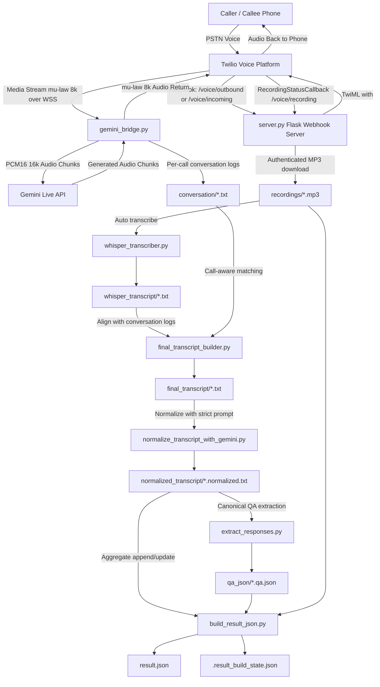

# Carecaller Architecture Diagram and Detailed Flow

This document provides:

1. A visual architecture diagram
2. A detailed flow of how data moves through every stage
3. Error handling and fallback behavior at each step

---

## 1) System architecture diagram

### 1.1 Block diagram (ASCII)

```text
┌───────────────────────────┐
│   Caller / Callee Phone   │
└─────────────┬─────────────┘
        │ PSTN Voice
        v
┌───────────────────────────┐
│   Twilio Voice Platform   │
└───────┬───────────┬───────┘
  │           │
  │Webhook    │Media Stream (μ-law 8k over WSS)
  v           v
┌───────────────────────────┐      ┌───────────────────────────┐
│   server.py (Flask API)   │      │      gemini_bridge.py     │
│ /voice/* + /recording     │<---->│ audio convert + streaming │
└───────┬───────────────────┘      └─────────────┬─────────────┘
  │                                          │
  │ RecordingStatusCallback                  │ PCM16 16k
  v                                          v
┌───────────────────────────┐              ┌─────────────────────┐
│     recordings/*.mp3      │              │   Gemini Live API   │
└─────────────┬─────────────┘              └─────────────────────┘
        │
        v
┌───────────────────────────┐
│   whisper_transcriber.py  │
└─────────────┬─────────────┘
        v
┌───────────────────────────┐
│ whisper_transcript/*.txt  │
└─────────────┬─────────────┘
        v
┌───────────────────────────┐        ┌──────────────────────────┐
│ final_transcript_builder  │<------>│   conversation/*.txt     │
└─────────────┬─────────────┘        └──────────────────────────┘
        v
┌───────────────────────────┐
│ normalize_transcript_*    │
└─────────────┬─────────────┘
        v
┌───────────────────────────┐
│ normalized_transcript/*   │
└───────┬───────────────────┘
  │
  ├──────────────>┌───────────────────────────┐
  │               │    extract_responses.py   │
  │               └─────────────┬─────────────┘
  │                             v
  │                    ┌───────────────────────┐
  │                    │    qa_json/*.qa.json  │
  │                    └─────────────┬─────────┘
  │                                  │
  v                                  v
      ┌───────────────────────────────────────────────┐
      │              build_result_json.py             │
      │ merges normalized + QA + durations + state    │
      └───────────────────┬───────────────────────────┘
        │
      ┌─────────────┴─────────────┐
      v                           v
  ┌───────────────────────┐   ┌─────────────────────────────┐
  │      result.json      │   │ .result_build_state.json    │
  │ aggregated dataset    │   │ incremental processed state │
  └───────────────────────┘   └─────────────────────────────┘
```

### 1.2 Mermaid diagram



---

## 2) Component-by-component responsibilities

## 2.1 `call.py` (outbound call initiator)

**Primary responsibility:** place outbound calls through Twilio.

**Key behavior:**
- Loads env using `load_dotenv(override=True)`.
- Uses defaults from `.env` if CLI args are omitted.
- Enables recording by default when `RECORD_CALLS=true`.
- Sends Twilio URL/TwiML to direct call into webhook flow.

**Failure modes handled:**
- Missing numbers / credentials -> validation errors.
- Twilio API errors -> prints status/code/message (e.g., 401/20003).

---

## 2.2 `server.py` (orchestration hub)

**Primary responsibility:** return TwiML, handle recording callbacks, and trigger processing pipeline.

**Endpoints:**
- `GET /health`
- `POST /voice/incoming`
- `POST /voice/outbound`
- `POST /voice/events`
- `POST /voice/recording`

**Critical functions:**
1. Build voice TwiML with `<Connect><Stream>` to bridge URL.
2. On recording completion callback, download MP3 securely.
3. Trigger background post-processing chain based on automation flags.

**Failure modes handled:**
- Missing recording URL -> 400
- Missing Twilio credentials for download -> 500
- Network download failures -> 502
- Post-processing exceptions -> logged in app logger

---

## 2.3 `gemini_bridge.py` (live audio bridge)

**Primary responsibility:** realtime audio conversion and bidirectional streaming.

**Input/output transforms:**
- Twilio -> Gemini: mu-law 8k -> PCM16 16k
- Gemini -> Twilio: PCM -> mu-law 8k

**Additional behavior:**
- Handles interruption logic to reduce speaking-over-user issues.
- Writes conversation transcript files in `conversation/` for each call.

**Failure modes handled:**
- Stream interruptions / websocket issues
- Audio chunk irregularities
- Runtime reconnection/error logs

---

## 2.4 `whisper_transcriber.py`

**Primary responsibility:** convert MP3 recording into timestamped transcript text.

**Behavior:**
- Uses faster-whisper model/config from env.
- Stores output in `whisper_transcript/`.
- Supports GPU-focused settings and strict CUDA behavior when configured.

**Failure modes handled:**
- Missing CUDA runtime (if fallback disabled -> fail fast)
- Model/device errors

---

## 2.5 `final_transcript_builder.py`

**Primary responsibility:** produce speaker-labeled transcript by combining ASR and conversation logs.

**Behavior:**
- Finds matching conversation file by call context.
- Performs text similarity/ordering logic.
- Emits lines like `[start-end] agent|user> text`.

**Failure modes handled:**
- No conversation match found -> warning and skip
- Alignment ambiguity -> best-effort output

---

## 2.6 `normalize_transcript_with_gemini.py`

**Primary responsibility:** produce machine-stable transcript format for extraction.

**Contract enforced:**
- First line must be `outcome=<label>`
- Remaining lines must be strict `[AGENT]: ...` / `[USER]: ...`
- Prompt includes canonical-question and correction handling constraints

**Grounding strategy:**
- Uses matching conversation context (agent-focused lines) to keep question phrasing stable.

**Failure modes handled:**
- Missing API key -> explicit error
- Non-conforming model output -> post-sanitization/enforcement helpers

---

## 2.7 `extract_responses.py`

**Primary responsibility:** map user answers to 14 canonical questions.

**Behavior:**
- Reads normalized transcript structure.
- Outputs deterministic `qa_json/*.qa.json` list of `{question, answer}`.

**Failure modes handled:**
- Missing answers -> empty strings
- Partial conversations -> partial population

---

## 2.8 `build_result_json.py`

**Primary responsibility:** aggregate normalized transcript + QA + metadata into final dataset.

**Input sources:**
- `normalized_transcript/*.normalized.txt`
- `qa_json/*.qa.json`
- `recordings/*.mp3` (duration)

**Output targets:**
- `result.json`
- `.result_build_state.json`

**Deterministic behavior details:**
- If `result.json` is missing/empty/invalid -> fallback to `expected_result.json` or empty skeleton.
- If state is missing/corrupt -> initialize state from existing normalized files and avoid backfill on that run.
- Appends only new items (tracked + dedup by `transcript_text`).

**Failure modes handled:**
- Invalid JSON sources -> safe fallback
- Missing QA file -> empty responses list
- Missing recording -> duration=0 with warning
- MP3 parse failures -> duration=0 with warning

---

## 3) End-to-end detailed runtime flow

## Phase A: Live call setup and streaming

1. Operator runs `call.py`.
2. Twilio call is created (`to`, `from`, webhook URL/TwiML).
3. Twilio hits `server.py` endpoint (`/voice/outbound` or `/voice/incoming`).
4. `server.py` responds with TwiML containing `<Connect><Stream>` to `MEDIA_STREAM_URL`.
5. Twilio opens media websocket to `gemini_bridge.py`.
6. Bridge forwards converted audio to Gemini Live and returns generated audio to Twilio.
7. Caller and AI converse in real time.
8. Bridge writes conversation logs for the call.

## Phase B: Recording callback and download

9. Twilio finishes recording and posts to `/voice/recording`.
10. `server.py` validates event state (`completed`) and recording URL.
11. `server.py` downloads `RecordingUrl + .mp3` with Twilio Basic Auth.
12. MP3 saved in `recordings/` with call/recording IDs in filename.

## Phase C: Post-call processing chain

13. If `AUTO_TRANSCRIBE_RECORDINGS=true`, background job starts.
14. `whisper_transcriber.py` creates transcript in `whisper_transcript/`.
15. If `AUTO_BUILD_FINAL_TRANSCRIPT=true`, builder aligns with `conversation/` and writes `final_transcript/`.
16. If `AUTO_NORMALIZE_TRANSCRIPT=true`, Gemini normalizer writes `normalized_transcript/`.
17. If `AUTO_SAVE_QA_JSON=true`, response extractor writes `qa_json/`.
18. If `AUTO_UPDATE_RESULT_JSON=true`, result builder updates `result.json` and state file.

## Phase D: Incremental dataset behavior

19. Every run checks `.result_build_state.json`.
20. Previously processed normalized files are skipped.
21. New normalized files are parsed/merged and appended.
22. `total_samples` recalculated and saved.
23. State file updated with processed filename list.

---

## 4) Data contracts at each stage

## 4.1 Normalized transcript contract

- Line 1: `outcome=<label>`
- Remaining lines:
  - `[AGENT]: ...`
  - `[USER]: ...`

## 4.2 QA JSON contract

List of objects:

```json
[
  {"question": "How have you been feeling overall?", "answer": "..."}
]
```

## 4.3 Result JSON contract (simplified)

```json
{
  "total_samples": 0,
  "transcripts": [
    {
      "outcome": "completed",
      "call_duration": 120,
      "direction": "outbound",
      "transcript": [{"role": "agent", "message": "..."}],
      "transcript_text": "[AGENT]: ... [USER]: ...",
      "responses": [{"question": "...", "answer": "..."}]
    }
  ]
}
```

---

## 5) Operational checkpoints (recommended)

1. Health endpoint returns OK before placing calls.
2. Bridge websocket reachable publicly over WSS.
3. Recording callback URL reachable publicly over HTTPS.
4. New call produces files in `recordings/`, then downstream folders.
5. `result.json` increments only for new calls.

---

## 6) Common incident map

- **Twilio 401/20003** -> credential mismatch/stale env.
- **No recording saved** -> callback URL or credentials issue.
- **No transcription** -> whisper device/model/runtime issue.
- **No normalization** -> Gemini key/model/prompt failure.
- **No `result.json` update** -> automation flag off or no new normalized files.
- **Unexpected backfill** -> state file policy mismatch.

---

## 7) Summary

The system is designed as a staged, file-backed pipeline with explicit contracts and incremental state tracking. This design makes it easier to debug each step independently while still enabling full automation end-to-end.
